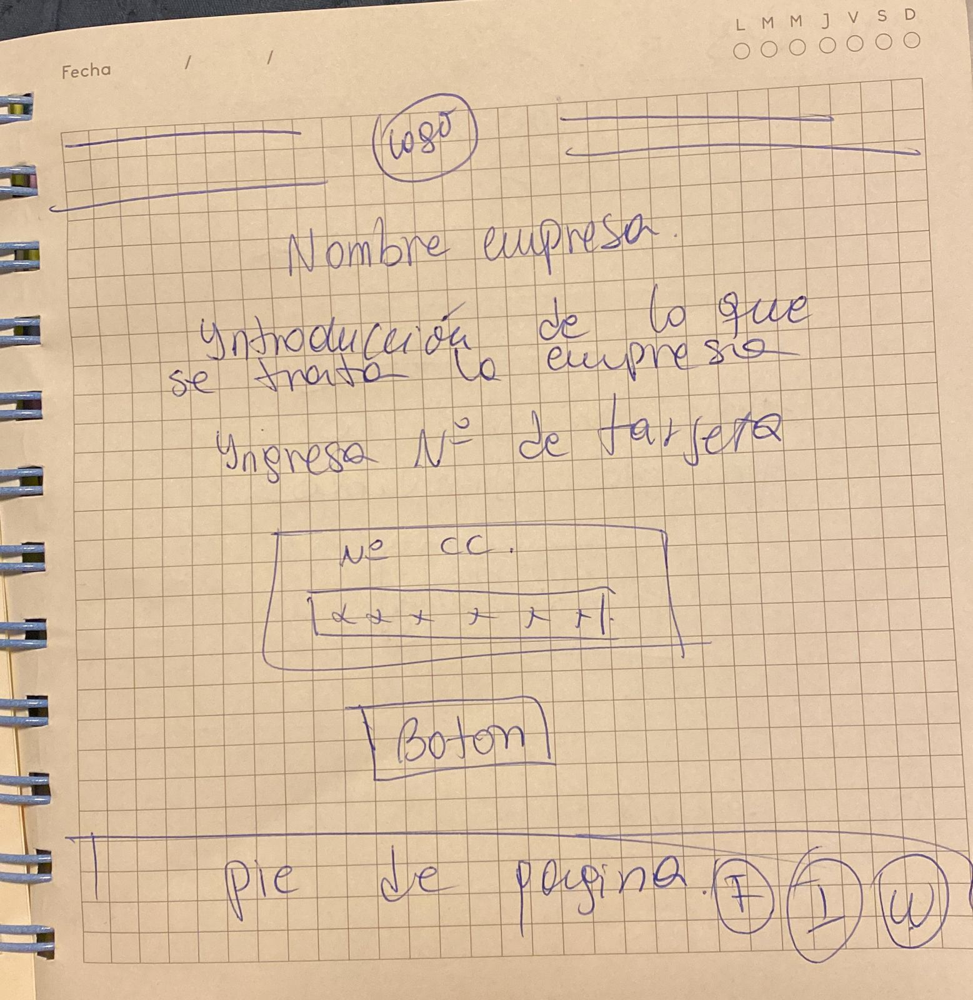
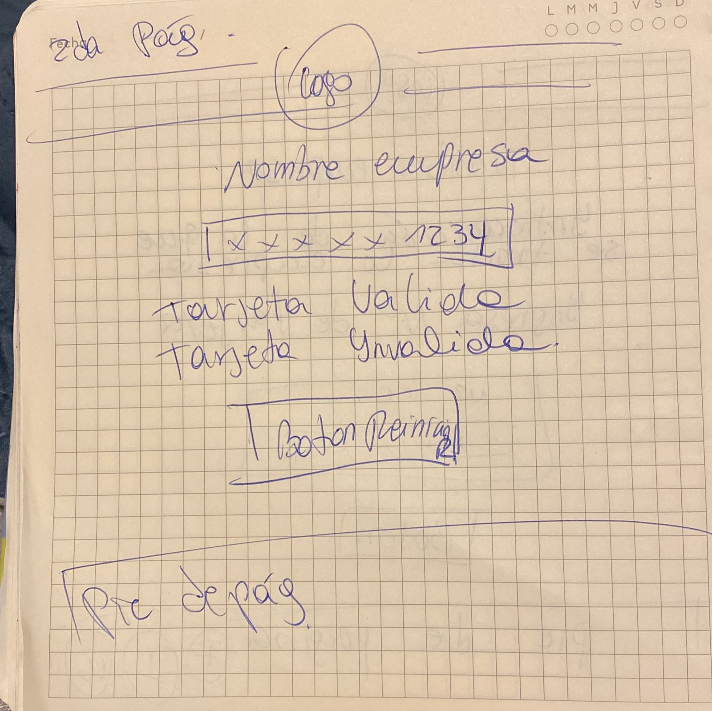
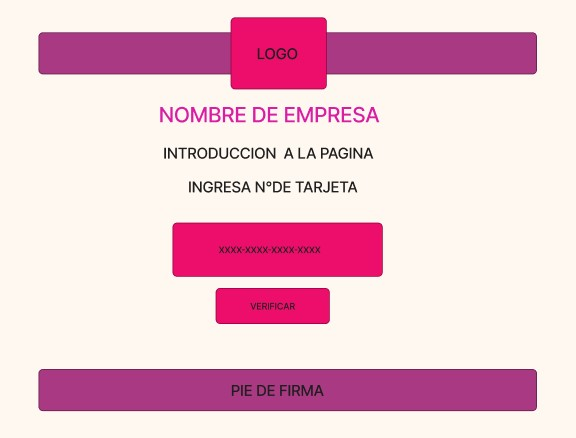
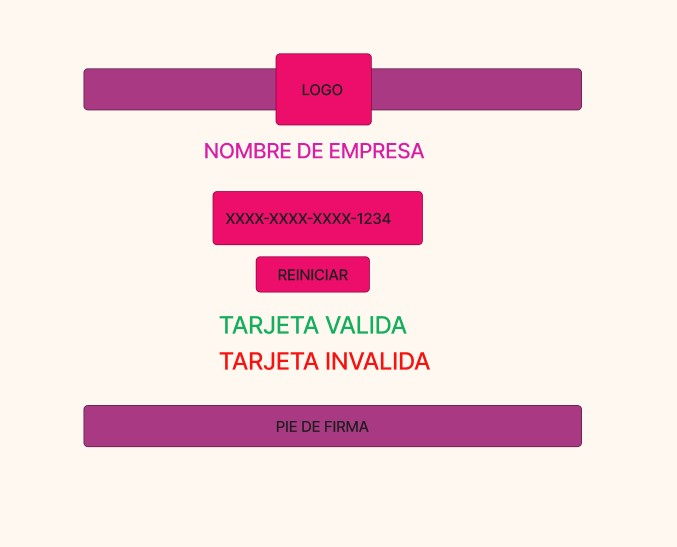

# Pastelería y Repostería Mondelicias

Mi proyecto es acerca de una página web de una empresa familiar que ofrece servicios de pastelería y repostería.

 - ## ¿Quiénes son los principales usuarios de producto?

Principalmente familias donde realizaran eventos como cumpleaños, bautizos, matrimonios, baby shower, etc. 

- ## ¿Cuáles son los objetivos de estos usuarios en relación con tu producto?

El principal objetivo es encontrar una deliciosa torta. Algo original con un buen sabor y totalmente personalizado en cuanto al diseño. También esta el área de repostería que ofrece dulces como galletas, merengues, dulces chilenos, etc.

- ## ¿Cómo crees que el producto que estás creando está resolviendo sus problemas?

Resuelve los problemas en cuanto a la rapidez para realizar la compra y el hecho de que no debes ir a la tienda a comprar, ya que al comprar por una página web el producto llegará a la puerta de tu hogar.

## Feedback

Respecto al diseño de la página recibí varios feedback donde me indicaban mejoras a realizar. Por ejemplo en mi diseño original yo tenia la introducción a la pagina en un inicio y después tenia el cuadro donde ingresar el N° de tarjeta de crédito, lo que modifique ya me indicaron que lo principal de mi página era validar la tarjeta así que debía estar en el centro de la pantalla.

## Prototipos

El primer prototipo realizado fue a mano alzada en una hoja de papel, donde plasme la idea de la página web en cuanto a diseño pero no a funcionalidad.

El segundo prototipo lo realice en figma para tener una idea de como hacer el diseño y en cuanto a la peleta de colores que iba a utilizar para la página web.

A continuación les muestro como quedo finalmente la página web ya con logo, colores definitivos, tipo de letras, etc.

